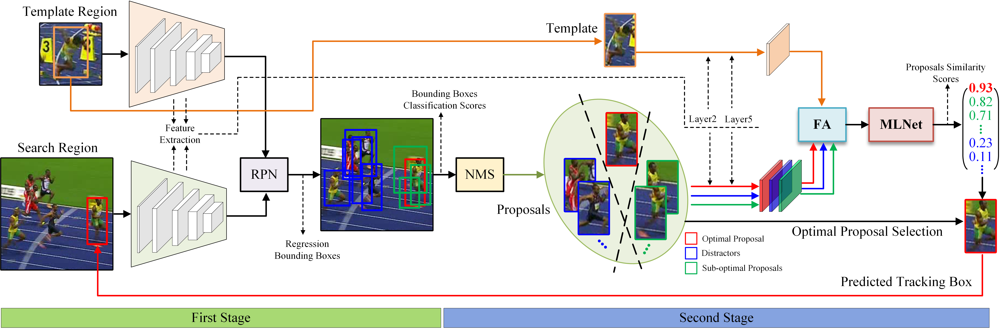
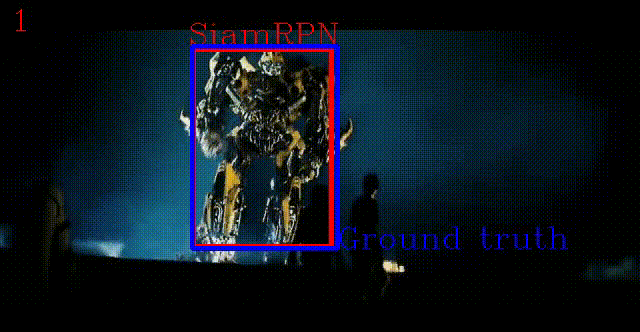
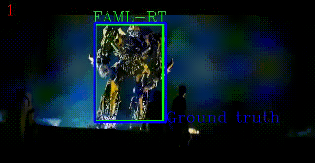

# FAML-RT

## Overall architecture(Zoom-in)



## Demo

 
 
 

## Instructions
Details can be referred to [FAML-RT](https://www.sciencedirect.com/science/article/abs/pii/S0020025523002797)

## Citation
If you find PTTR useful, please consider citing:

```bibtex
@article{nie2023faml,
  title={FAML-RT: Feature Alignment-based Multi-level Similarity Metric Learning Network for a Two-stage Robust Tracker},
  author={Nie, Jiahao and Dong, Zhekang and He, Zhiwei and Wu, Han and Gao, Mingyu},
  journal={Information Sciences},
  year={2023},
  publisher={Elsevier}
}
```


<h1 align="center">Implementation of "SATrack: Rethinking Motion-Centric Paradigm for 3D Single Object  
Tracking with Point Cloud Spatial Alignment" for CVPR2024 double-blind review</h1>


## Introduction
<p align="justify">3D single object tracking (SOT) has long suffered from incomplete, textureless and semantically deficient LiDAR point clouds, especially for the Siamese appearance matching paradigm. While recent motion-centric paradigm exploits motion information instead of appearance matching for tracking, it inevitably incurs multi-stage processing and auxiliary network modules. In this paper, we rethink the motion-centric paradigm in depth by a series of explorations. These explorations prove that directly inferring target relative motion from point clouds across consecutive frames is feasible, and spatial alignment of adjacent point clouds significantly facilitates motion modeling. We thereby introduce a simple yet effective framework, dubbed SATrack for 3D SOT. Leveraging merely a plain regression loss, our framework can easily infer accurate target relative motion between two consecutive frames. Following this framework, we present SATrack-point and SATrack-voxel tracking models, incorporating implicit and explicit spatial alignment of point clouds through point- and voxel-based representation, respectively. Without bells and whistles, SATrack-voxel sets a new state-of-the-art performance (~89%, 72% and 63% precision on KITTI, NuScenes and Waymo Open Dataset, respectively). Moreover, under the same point-based representation, SATrack-point outperforms the previous motion tracker M2Track by 3.3% and 6.7% on the KITTI and NuScenes, while running at a considerably high speed of 107 Fps on a single RTX3090 GPU. 


## Setup

Here, we list the most important part of our dependencies

|Dependency|Version|
|---|---|
|python|3.9.0|
|pytorch|2.0.1 (cuda11.8)|
|mmegine|0.7.3|
|mmcv|2.0.0|
|mmdet|3.0.0|
|mmdet3d|1.1.0|
|spconv|2.3.6 (cu118)|

## Dataset Preparation

### KITTI

+ Download the data for [velodyne](http://www.cvlibs.net/download.php?file=data_tracking_velodyne.zip), [calib](http://www.cvlibs.net/download.php?file=data_tracking_calib.zip) and [label_02](http://www.cvlibs.net/download.php?file=data_tracking_label_2.zip) from [KITTI Tracking](http://www.cvlibs.net/datasets/kitti/eval_tracking.php).
+ Unzip the downloaded files.
+ Put the unzipped files under the same folder as following.
  ```
  [Parent Folder]
  --> [calib]
      --> {0000-0020}.txt
  --> [label_02]
      --> {0000-0020}.txt
  --> [velodyne]
      --> [0000-0020] folders with velodynes .bin files
  ```

### NuScenes

+ Download the dataset from the [download page](https://www.nuscenes.org/download)
+ Extract the downloaded files and make sure you have the following structure:
  ```
  [Parent Folder]
    samples	-	Sensor data for keyframes.
    sweeps	-	Sensor data for intermediate frames.
    maps	        -	Folder for all map files: rasterized .png images and vectorized .json files.
    v1.0-*	-	JSON tables that include all the meta data and annotations. Each split (trainval, test, mini) is provided in a separate folder.
  ```
>Note: We use the **train_track** split to train our model and test it with the **val** split. Both splits are officially provided by NuScenes. During testing, we ignore the sequences where there is no point in the first given bbox.


### Waymo Open Dataset

* We follow the benchmark created by [LiDAR-SOT](https://github.com/TuSimple/LiDAR_SOT) based on the waymo open dataset. You can download and process the waymo dataset as guided by [LiDAR_SOT](https://github.com/TuSimple/LiDAR_SOT), and use our code to test model performance on this benchmark.
* The following processing results are necessary
```
[waymo_sot]
    [benchmark]
        [validation]
            [vehicle]
                bench_list.json
                easy.json
                medium.json
                hard.json
            [pedestrian]
                bench_list.json
                easy.json
                medium.json
                hard.json
    [pc]
        [raw_pc]
            Here are some segment.npz files containing raw point cloud data
    [gt_info]
        Here are some segment.npz files containing tracklet and bbox data 
```
## Quick Start

### Training

* To train a model, you must specify the `.py` file. The `.py` file contains all the configurations of the dataset and the model. We provide `.py` files under the [configs](./configs) directory. 

* **Note:** Before running the code, you will need to edit the `.py` file by setting the `path` argument as the correct root of the dataset.

```bash
# single-gpu training
python train.py --config configs/voxel/kitti/car.py
# multi-gpu training
# you will need to edit the `train.py` file by setting the `config` argument
./dist_train.sh
```

### Testing

To test a trained model, specify the checkpoint location with `--resume_from` argument and set the `--phase` argument as `test`.
```bash
# single-gpu testing
python test.py --config configs/voxel/kitti/car.py --load_from pretrained/voxel/kitti/car_73.45_86.58.pth
# multi-gpu testing
# you will need to edit the `test.py` file by setting the `config` and 'load_from' argument
./dist_test.sh
```

## Acknowledgement
This repo is heavily built upon [Open3DSOT](https://github.com/Ghostish/Open3DSOT) and [MMDetection3D](https://github.com/open-mmlab/mmdetection3d).


## Relevant Projects

[1] <strong>GLT-T: Global-Local Transformer Voting for 3D Single Object Tracking in Point Clouds, AAAI, 2023</strong> | [Paper](https://arxiv.org/abs/2211.10927) | [Github](https://github.com/haooozi/GLT-T) <br><em>&ensp; &ensp; &ensp;Jiahao Nie<sup>&#8727;</sup>, Zhiwei He<sup>&#8727;</sup>, Yuxiang Yang, Mingyu Gao, Jing Zhang</em>

[2] <strong>OSP2B: One-Stage Point-to-Box Network for 3D Siamese Tracking, IJCAI, 2023</strong> | [Paper](https://arxiv.org/abs/2304.11584) | [Github](https://github.com/haooozi/OSP2B) <br><em>&ensp; &ensp; &ensp;Jiahao Nie<sup>&#8727;</sup>, Zhiwei He<sup>&#8727;</sup>, Yuxiang Yang, Zhengyi Bao, Mingyu Gao, Jing Zhang</em>
